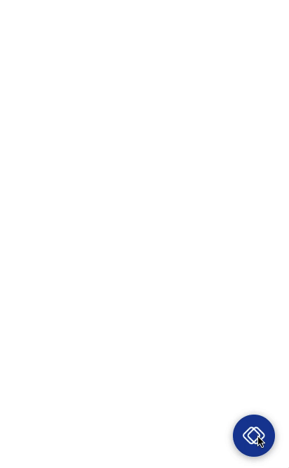

# Push Webchat 

A simple webchat widget to connect with Push 💬platform. Originally forked from [rasa-webchat](https://github.com/botfront/rasa-webchat) and [react-chat-widget](https://github.com/Wolox/react-chat-widget) and optimized for [Push](https://push.al).
## Features

- Text Messages
- Quick Replies
- Images and Videos
- Markdown support
- Easy to import in a script tag or as a React Component
- Persistent sessions
- Typing indications
- Smart delay between messages



## Usage

### In a `<script>` tag

In your `<body/>`:
```javascript
<div id="webchat"/>
<script src="https://ilhasoft-webchat.s3-eu-west-1.amazonaws.com/webchat-latest.js"></script>
// Or you can replace latest with a specific version
<script>
  WebChat.default.init({
    selector: "#webchat",
    initPayload: "Hello",
    channelUuid: '37e3fde9-5a54-4d11-9adc-78629ffaa2e3', // External Channel UUID from Push
    host: 'https://new.push.al', // Host URL from Push
    socketUrl: "https://socket.push.al",
    title: "Title",
    subtitle: "Subtitle",
  })
</script>
```

About images: `width` and `height` define the size in pixels that images in messages are crop-scaled to. If not present, the image will scale to the maximum width of the container and the image.

It is recommended to use a particular version (i.e. "webchat-<version>.js") however the file "webchat-latest.js"
is also available and is updated continuously with the latest version.

### As a React component

Install the package from GitHub by running:
```bash
npm install push-webchat
```

Then once it is installed it can be implemented as follows.

```javascript
import { Widget } from 'push-webchat';

function CustomWidget = () => {
  return (
    <Widget
      initPayload={"/get_started"}
      socketUrl={"https://socket.push.al"}
      title={"Title"}
    />
  )
}
```

- Make sure to have the prop `embedded`
set to `true` if you don't want to see the launcher.


## Parameters
| Prop / Param                 | Default value          | Description                                                                                                                                                                                                                                                                                                                                                                                                                                                                                                                  |
|------------------------|--------------------|------------------------------------------------------------------------------------------------------------------------------------------------------------------------------------------------------------------------------------------------------------------------------------------------------------------------------------------------------------------------------------------------------------------------------------------------------------------------------------------------------------------------------|
| `initPayload`          | `null`             | Payload sent to Push when conversation starts                                                                                                                                                                                                                                                                                                                                                                                                                                                                                |
| `socketUrl`            | `null`             | Socket URL                                                                                                                                                                                                                                                                                                                                                                                                                                                                                                                   |
| `customData`           | `null`             | Arbitrary object sent with the socket. It's not supported by Push at the moment.                                                                                                                                                                                                                                                                                                                                                                                                                                             |
| `docViewer`            | `false`            | If you add this prop to the component or to the init script, `docViewer=true` , this will treat links in received messages as links to a document ( `.pdf .doc .xlsx` etc. ) and will open them in a popup using `https://docs.google.com/viewer` service                                                                                                                                                                                                                                                                    |
| `title`                | `'Welcome"`        | Title shown in the header of the widget                                                                                                                                                                                                                                                                                                                                                                                                                                                                                      |
| `subtitle`             | `null`             | Subtitle shown under the title in the header of the widget                                                                                                                                                                                                                                                                                                                                                                                                                                                                   |
| `inputTextFieldHint`   | `"Type a message"` | User message input field placeholder                                                                                                                                                                                                                                                                                                                                                                                                                                                                                         |
| `hideWhenNotConnected` | `true`             | If `true` the widget will hide when the connection to the socket is lost                                                                                                                                                                                                                                                                                                                                                                                                                                                     |
| `connectOn`            | `"mount"`          | This prop lets you choose when the widget will try connecting to the server. By default, it tries connecting as soon as it mounts. If you select `connectOn='open'` it will only attempt connection when the widget is opened. it can only take the values `mount` and `open`.                                                                                                                                                                                                                                               |
| `onSocketEvent`        | `null`             | call custom code on a specific socket event                                                                                                                                                                                                                                                                                                                                                                                                                                                                                  |
| `embedded`             | `false`            | Set to `true` if you want to embed the in a web page. The widget will always be open and the `initPayload` will be triggered immediately                                                                                                                                                                                                                                                                                                                                                                                     |
| `showFullScreenButton` | `false`            | Show a full screen toggle                                                                                                                                                                                                                                                                                                                                                                                                                                                                                                    |
| `displayUnreadCount`   | `false`            | Path to an image displayed on the launcher when the widget is closed                                                                                                                                                                                                                                                                                                                                                                                                                                                         |
| `showMessageDate`      | `false`            | Show message date. Can be overriden with a function: `(timestamp, message) => return 'my custom date'`                                                                                                                                                                                                                                                                                                                                                                                                                       |
| `customMessageDelay`   | See below          | This prop is a function, the function take a message string as an argument. The defined function will be called everytime a message is received and the returned value will be used as a milliseconds delay before displaying a new message.                                                                                                                                                                                                                                                                                 |
| `params`               | See below          | Essentially used to customize the image size.                                                                                                                                                                                                                                                                                                                                                                                                                                                                                |
| `storage`              | `"local"`          | Specifies the storage location of the conversation state in the browser. `"session"` defines the state to be stored in the session storage. The session storage persists on reload of the page, and is cleared after the browser or tab is closed, or when `sessionStorage.clear()`is called. `"local"` defines the state to be stored in the local stoage. The local storage persists after the the browser is closed, and is cleared when the cookies of the browser are cleared, or when `localStorage.clear()`is called. |
| `customComponent`      | `null`             | Custom component to be used with custom responses. E.g.: `customComponent={ (messageData) => (<div>Custom React component</div>)` }                                                                                                                                                                                                                                                                                                                                                                                          |

| `onWidgetEvent`        | `{}`             | call custom code on a specific widget event ( onChatOpen, onChatClose, onChatHidden, are available for now ), add a function to the desired object property in the props to have it react to the event.

### Additional Examples

##### `customMessageDelay`
```javascript
(message) => {
    let delay = message.length * 30;
    if (delay > 2 * 1000) delay = 3 * 1000;
    if (delay < 400) delay = 1000;
    return delay;
}
```

##### `onSocketEvent`
```jsx
onSocketEvent={{
  'connect': () => console.log('connection established'),
  'disconnect': () => doSomeCleanup(),
}}
```

##### `params`

The `params` props only allows to specify custom image dimensions:
```jsx
params={{
        images: {
          dims: {
            width: 300,
            height: 200
          }
        }
      }}
```

### Other features

#### Tooltip

Text messages received when the widget is closed will be shown as a tooltip.

#### Sending a message on page load

When reconnecting to an existing chat session, the bot will send a message contained in the localStorage key specified by the `NEXT_MESSAGE` constant. The message should be stringified JSON with a `message` property describing the message and an `expiry` property set to a UNIX timestamp in milliseconds after which this message should not be sent. This is useful if you would like your bot to be able to offer your user to navigate around the site.


## API

| Method                                   | Description                                                                                                                                                              |
|------------------------------------------|--------------------------------------------------------------------------------------------------------------------------------------------------------------------------|
| `WebChat.toggle()`                       | Toggle the open/close state of the chat window, send initPayload if webchat is not initialized and is toggled open                                                       |
| `WebChat.open()`                         | Open the chat window, send initPayload if webchat is not initialized                                                                                                     |
| `WebChat.close()`                        | Close the chat window                                                                                                                                                    |
| `WebChat.isOpen()`                       | Get the open/closed state of the widget                                                                                                                                  |
| `WebChat.show()`                         | Show the chat widget, send initPayload if the chat is in open state and not initialized                                                                                  |
| `WebChat.hide()`                         | Hide the chat widget                                                                                                                                                     |
| `WebChat.isVisible()`                    | Get the shown/hidden state of the widget                                                                                                                                 |
| `WebChat.send(payload, text: optionnal)` | send a payload (`/hello` to Push. If `text` is specified, it will be displayed as a user message. If not specified, no user message will be displayed |                                                                       |

### Backends

The widget can be used with Push socket server. Contact contato@ilhasoft.com.br if you want to use it.


#### Push

The Push Webchat was forked from an open source project [rasa-webchat](https://github.com/botfront/rasa-webchat) team and it works with [Push](https://push.al).

##### Sending messages from the backend to the chat widget

###### sending plain text

```python
emit(session_id, {"text": "hello"})
```

###### sending quick replies

```python
message = {
  "text": "Happy?",
  "quick_replies":[
    {"title":"Yes", "payload":"/affirm"},
    {"title":"No", "payload":"/deny"}
  ]}
emit(session_id, message)
```

###### sending a link Snippet

Admittedly a bit far fetched, thinking that Snippets would evolve to carousels
of generic templates :)

```python
message = {
  "attachment":{
    "type":"template",
    "payload":{
      "template_type":"generic",
      "elements":[
        {
          "title":"Title",
          "buttons":[ {
            "title":"Link name",
            "url": "http://link.url"
          }
        ]
      }
    ]
  }
}
}
emit(session_id, message)
```

###### sending a Video Message

```python
message = {
  "attachment":{
    "type":"video",
    "payload":{
      "title":"Link name",
      "src": "https://www.youtube.com/watch?v=f3EbDbm8XqY"
    }
  }
}
emit(session_id, message)
```

###### sending an Image Message

```python
message = {
      "attachment":{
        "type":"image",
        "payload":{
          "title":"Link name",
          "src": "https://encrypted-tbn0.gstatic.com/images?q=tbn:ANd9GcT_IX5FSDQLrwm9qvuXu_g7R9t_-3yBSycZ8OxpRXvMDaTAeBEW"
        }
      }
    }
emit(session_id, message)
```

###### sending a message with custom data

```python
message = {
      "data":{
        "customField1": 'anything you want',
        "customField2": 'other custom data, 
      }
    }
emit(session_id, message)
```
###### sending a message to be displayed as a tooltip

You first need to set a tooltipPayload in the props of the component, then, for the answer to that payload, you should define a response with a 

object and a property `tooltip = true`. This message will then be displayed as a tooltip before the widget is opened.
This is not supported by Push yet.

The prop `tooltipDelay` lets you set a delay before calling the payload. It default to 500ms.

```python
message = {
  "text": "Hi!",
  "metadata":{
    "tooltip": true
   }
 }
emit('bot_uttered', message, room=socket_id)
```


## Styles

hierarchy:
```
.conversation-container
  |-- .header
        |-- .title
        |-- .close-function
        |-- .loading
  |-- .messages-container
        |-- .message
              |-- .client
              |-- .response
        |-- .replies
              |-- .reply
              |-- .response
        |-- .snippet
              |-- .snippet-title
              |-- .snippet-details
              |-- .link
        |-- .imageFrame
        |-- .videoFrame
  |-- .sender
        |-- .new-message
        |-- .send
```

| Class                   |  Description                                                        |
|-------------------------|---------------------------------------------------------------------|
| .widget-container       | The div containing the chatbox of the default version               |
| .widget-embedded        | div of the embedded chatbox (using embedded prop)                   |
| .full-screen            | div of the fullscreen chatbox (using fullScreenMode prop)           |
| .conversation-container | the parent div containing the header, message-container and sender  |
| .messages-container     | the central area where the messages appear                          |
| .sender                 | div of the bottom area which prompts user input                     |
| .new-message            | the text input element of sender                                    |
| .send                   | the send icon element of sender                                     |
| .header                 | div of the top area with the chatbox header                         |
| .title                  | the title element of the header                                     |
| .close-button           | the close icon of the header                                        |
| .loading                | the loading status element of the header                            |
| .message                | the boxes holding the messages of client and response               |
| .replies                | the area that gives quick reply options                             |
| .snippet                | a component for describing links                                    |
| .imageFrame             | a container for sending images                                      |
| .videoFrame             | a container for sending video                                       |


## Contributors
[@Ilhasoft](https://github.com/Ilhasoft)
[@johncordeiro](https://github.com/johncordeiro)
[@PHLF](https://github.com/phlf)
[@znat](https://github.com/znat)
[@TheoTomalty](https://github.com/TheoTomalty)
[@Hub4IT](https://github.com/Hub4IT)
[@dliuproduction](https://github.com/dliuproduction)
[@MatthieuJnon](https://github.com/MatthieuJnon)
[@mofortin](https://github.com/mofortin)
